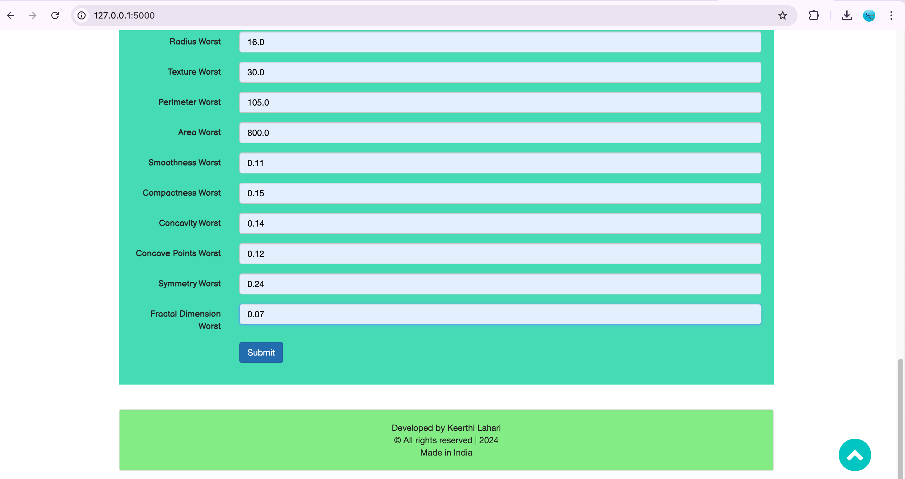

# Breast Cancer Prediction
> Predicts whether the type of breast cancer is Malignant or Benign

# Aim of the Project
#### > To predict if a breast cancer is Malignant or Benign using Image Dataset as well as Numerical Data
#### > Apply ML and DL Models to predict the severity of the Breast-Cancer
#### > Create a Wonderful UI for this project using Front End Languages and Frameworks (Like Bootstrap)
#### > Create the Backend using Flask Framework.
#### > Deploy on Cloud and make this wonderful project available to public

## About Project:

Breast cancer is the most common type of cancer in women. When cancers are found early, they can often be cured. 
Some devices detect breast cancer but many times they lead to false positives, which results 
in patients undergoing painful, expensive surgeries that were not even necessary. These type of cancers are called 
**benign** which do not require surgeries and we can reduce these unnecessary surgeries by using Machine Learning. 
I have taken the dataset of the previous breast cancer patients and train the model to predict whether the cancer is **benign** or **malignant**. These predictions will help doctors to do surgeries only when the cancer is malignant, thus reducing the unnecessary surgeries for women. 
 
For building the project I have used Wisconsin Breast cancer data which has 569 rows of which 357 are benign and 212 are malignant. 
The data is prepossessed and scaled. I have trained with Random forest Classifier gives the best accuracy of 95.0%. To provide an easy-to-use interface to doctors I have developed a website that will take the data and display the output with accuracy and time taken to predict.


## Languages or Frameworks Used 

  * Python: language
  * NumPy: library for numerical calculations
  * Pandas: library for data manipulation and analysis
  * SkLearn: library which features various classification, regression and clustering algorithms
  * Flask: microframework for building web applications using Python.
  
## Project Setup
  
  * First Clone the repository.
  * Create the virtual environment for the project. 
  ```sh
  $ conda create -n myenv python=3.6
  ```
  * Install the required packages using requirements.txt inside the environemnt using pip.
  ```sh
  $ pip install -r requirements.txt
  ```
  * run the app.py as `python app.py`
  * Web Application will be hosted at  `127.0.0.1:5000`
  * Enter the URL in the browser Application will be hosted.
  * Enter the details of the tumor to detect the type of the cancer with more than 95% accuracy.


*****

<div align="center">
<h4>Application UI</h4>
</div>

<div align="center">
<p>Home Page</p>
</div>


***** 

<div align="center">
<p>Tumor Data form</p>
</div>


*****
<div align="center">
<p>Tumor Data form</p>
</div>



***
<div align="center">
<p>Prediction Output</p>
</div>


